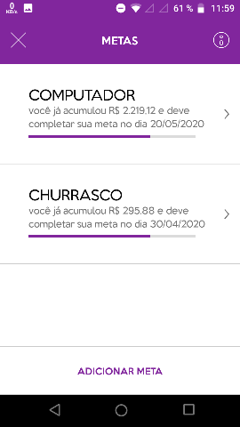

# NuPanca

An Android app developed in the BRASA Hacks 2020 hackathon. This app is supposed to be a function on Nubank's app, or an improvement on the already existing savings account. 

Main Screen | Goals Screen | Spendings Screen
--- | --- | --- |
 |  | 

## Installation

Open this project in android studio and build gradle from there. Everything should work fine. 

## Firebase

Link to firebase's console: https://console.firebase.google.com/project/nupanca-5c70b/overview?hl=en
